# Covid-19-Tracker :mask: :mask: :mask:
Covid-19 Tracker is a simple tracking Android application that lets you be updated on the current spread of Corona virus in different countries  

Download it here: https://bit.ly/2QUSwzN*

**Demo Screens:**  :rocket:

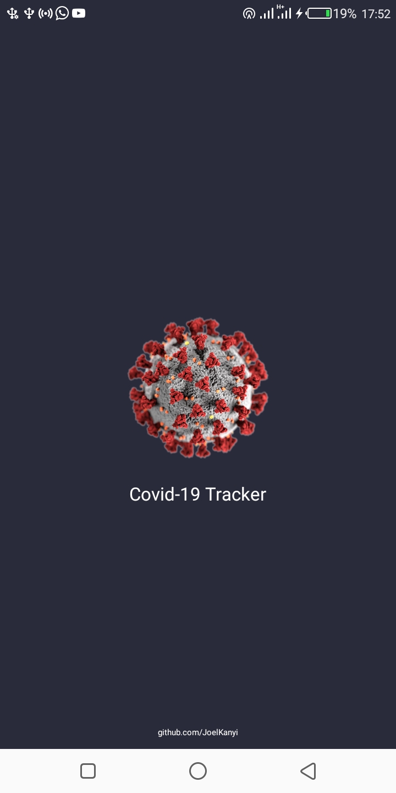
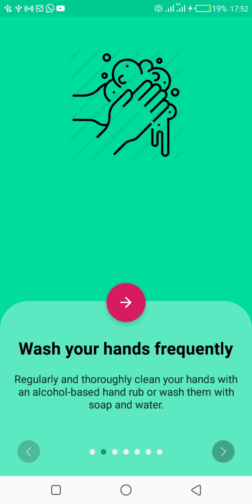
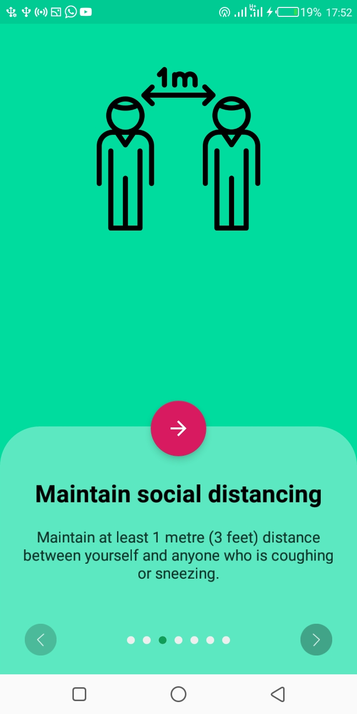
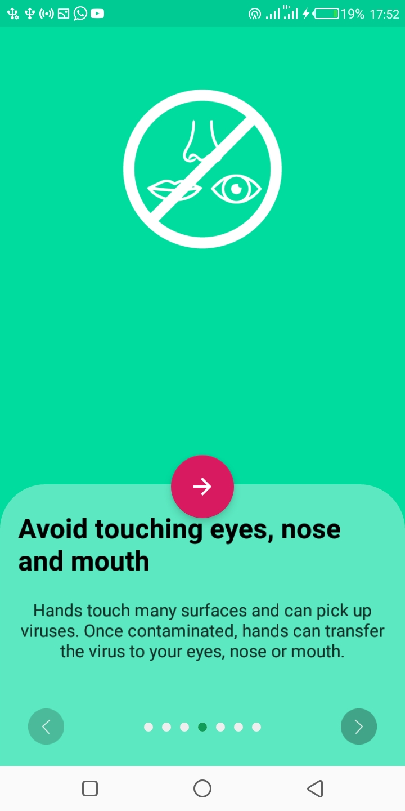
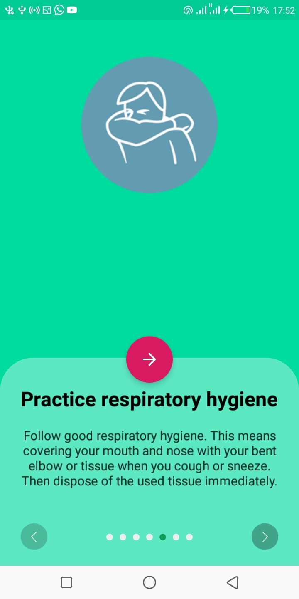
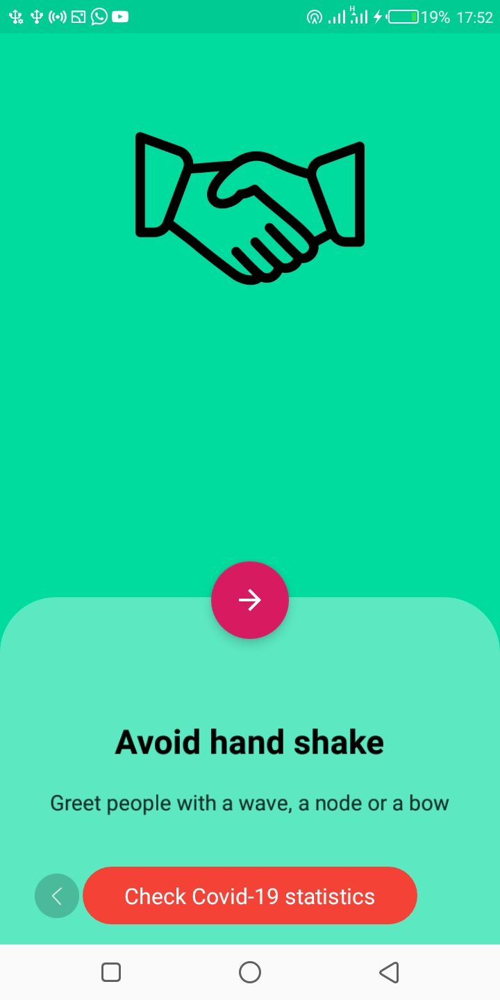
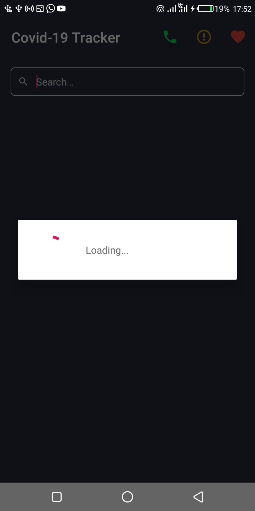
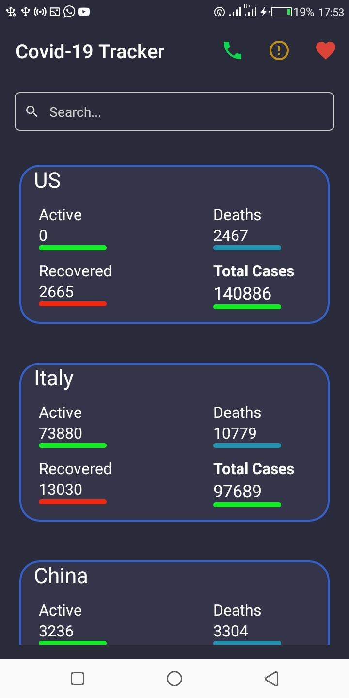
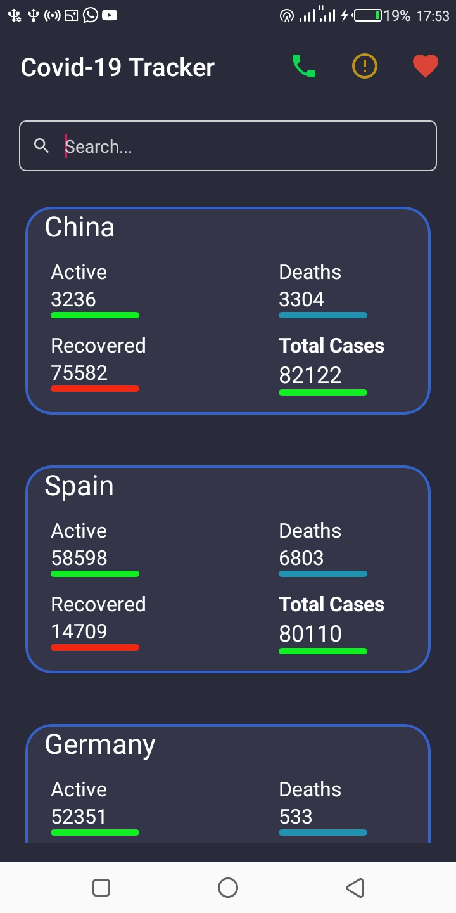
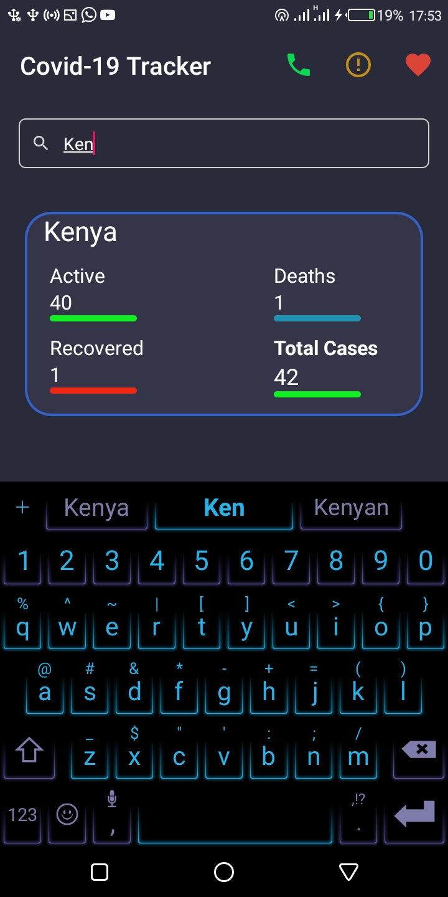
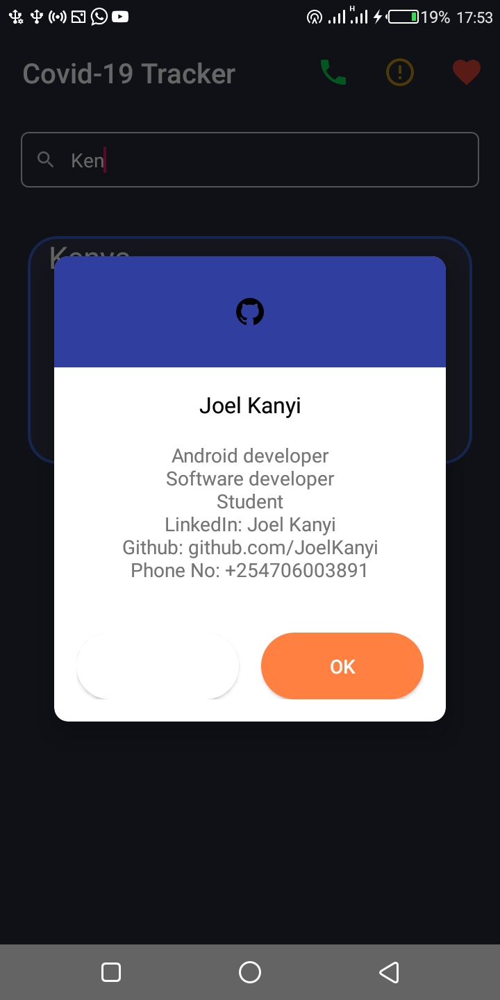
  

  
  
### Setup Requirements
- Android device or emulator
- Android Studio

### Getting Started
In order to get the app running yourself, you need to:
1.  clone this project
2.  Import the project into Android Studio
3.  Connect the android device with USB or just use your emulator
4.  In Android Studio, click on the "Run" button.

### Support
- Found this project useful ❤️? Support by clicking the ⭐️ button on the upper right of this page. ✌️

- Notice anything else missing? File an issue 

### Get in touch - Let's become friends
Please feel free to contact me if you have any questions, ideas or even if you just want to say hi. I’m up for talking, exchange ideas, collaborations or consults. You can connect with me through any of the avenues listed below:
- [Twitter](https://twitter.com/_joelkanyi)
- [Github](https://github.com/JoelKanyi)
- [Facebook](https://www.facebook.com/joel.kanyi.71)
- [LinkedIn](https://www.linkedin.com/in/joel-kanyi-037270174/) 
